# MAM---Documentation

## Planning

We decided to split the application development into Backend and Frontend with Tom and Alisa handling them respectively. Alisa is stronger in react than Tom and since Tom handled the ADD and DFD and Alisa designed the wireframes in Part A, this pathway made the most sense.

Sprints will be weekly in duration with a standup on Mondays deciding the tasks to completed for the week. We will recovene at the end of the week to update each other on our progress. Informal communication will be ongoing throughout the week.

All tasks will be added to Trello as tickets with labels indicating person to complete the task, whether it's server or client and a difficulty rating. The ratings are 1-Easy, 2-Medium, 3-Hard, 5-Very Hard, 8-Needs Breaking Down, 11-Needs Break Down.

There are 5 weekly sprint between Part A submission and Part B submission. We anticipate they will be broken down this way: 
Week starting 14 December: Planning 
Week starting 21 December: First prototype 
Week starting 28 December: Aim for usable final product 
Week starting 4 January: User testing 
Week starting 11 January: Finalize documentation ready for submission

---
## Libraries/Dependencies

### Server

**Library/Dependency**|**Description**
:-----|:-----
**aws-sdk** | Amazon web services software development kit for javascript. Allows developers to connect to AWS services through javascript objects
**connect-mongo** | Session store for MongoDB
**cors** | Enables CORS in an Express app
**dotenv** | Loads environment variables into process.env
**ejs** | Generates HTML markup with embedded javascript
**express** | Web application framework for Node
**express-fileupload** | Express middleware for uploading files
**express-session** | Session middleware for Express
**mongoose** | Object Data Modeling library for MongoDB and Node
**mongoose-bcrypt** | A mongoose plugin for encrypting fields with bcrypt
**passport** | Authentication middleware for Express/Node
**passport-local** | Passport strategy for authenticating with a username and password
**chai** | An assertion library for Node
**mocha** | Javascript testing framework
**nodemon** | Automatically restarts a Node application when changes are made

### Client

|**Library/Dependency**|**Description**
:-----|:-----
|**@material-ui/core** | A React UI framework comprising components, styles, themes and icons
**@material-ui/icons** | Material-UI icons as React components
**@material-ui/lab** | Material-UI components not available in core
**@react-google-maps/api** | React components wrapping the Google maps Javascript API
**@testing-library/jest-dom** | Custom Jest matchers for testing the DOM
**@testing-library/react** | React component testing
**@testing-library/user-event** | Simulates user interaction with the browser for testing purposes
**axios** | Promise based HTTP client for the browser and Node
**fontsource-roboto** | Self-host the 'Roboto' font
**google-maps-react** | A Google Map React component library
**react** | A Javascript library for building user interfaces
**react-dom** | Renders React components in the DOM
**react-geocode** | Transforms a location into it's longitude and latitude coordinates
**react-router-dom** | DOM bindings for React Router
**react-scripts** | Create React App scripts and configuration
**web-vitals** | Library for measuring all the Web Vitals metrics

---
## Sprints

  
14/12/20 - 20/12/20

  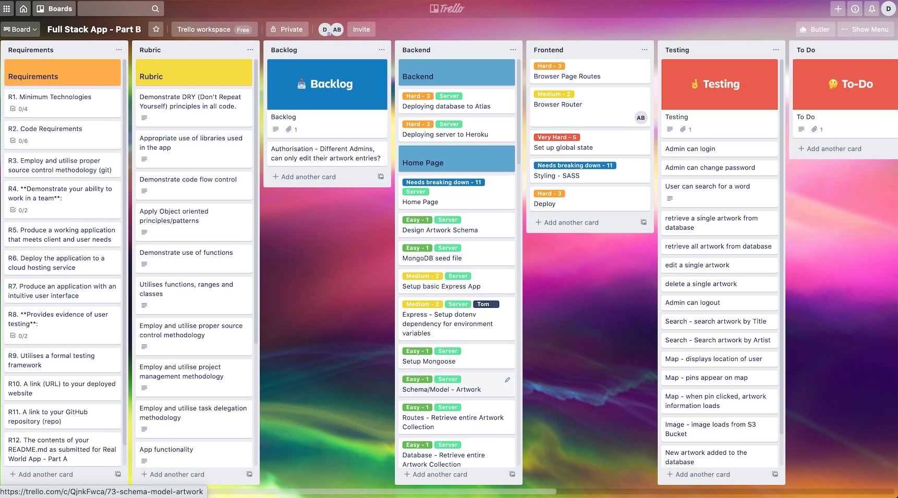
  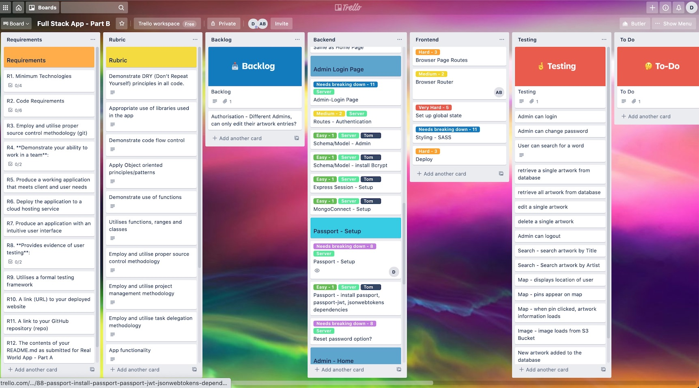
  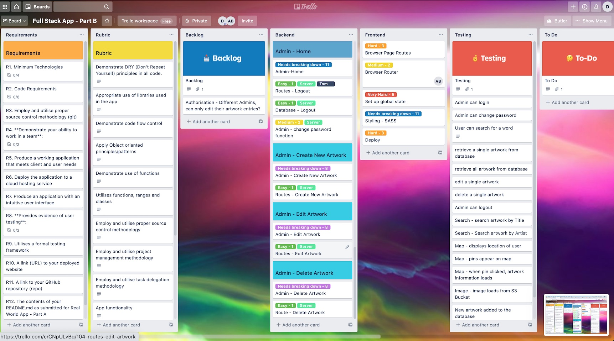

  
21/12/20 - 27/12/20

  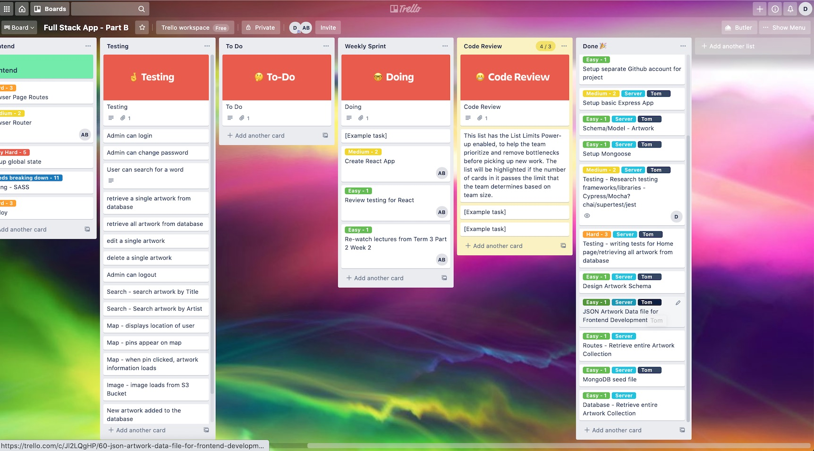
  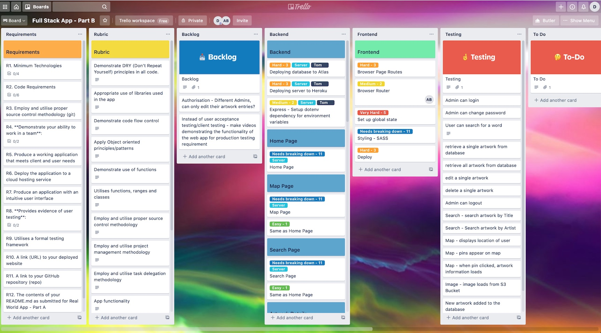

  
28/12/20 - 3/1/21

  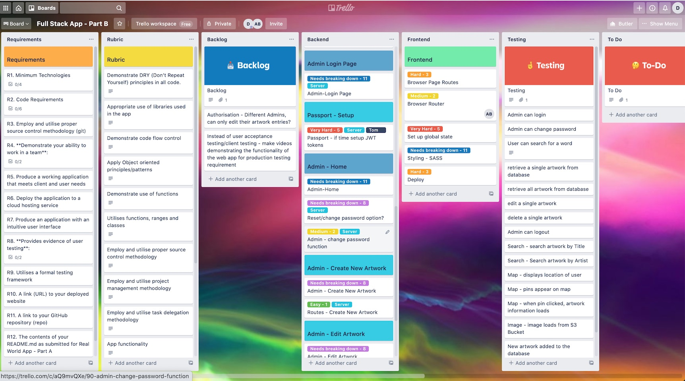
  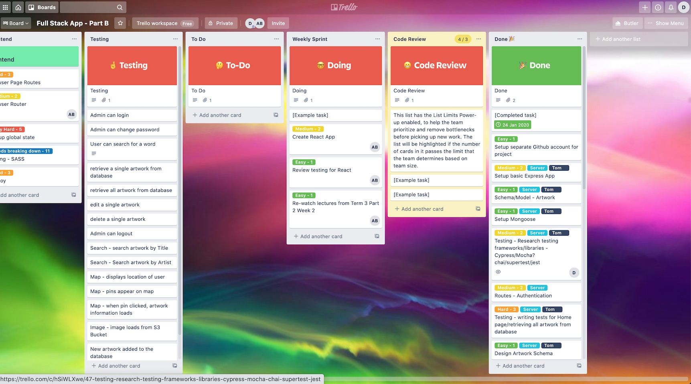
  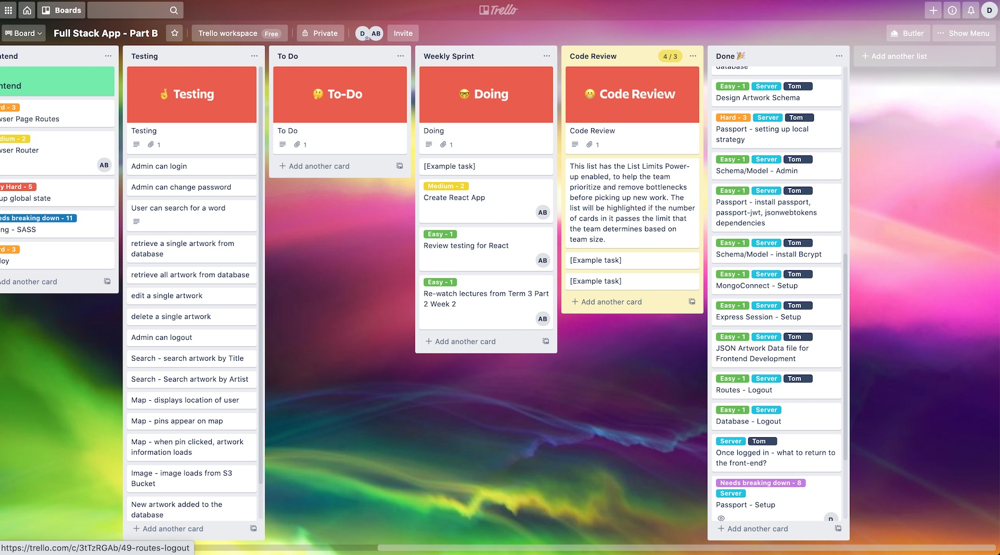

  
4/1/21 - 10/1/21

  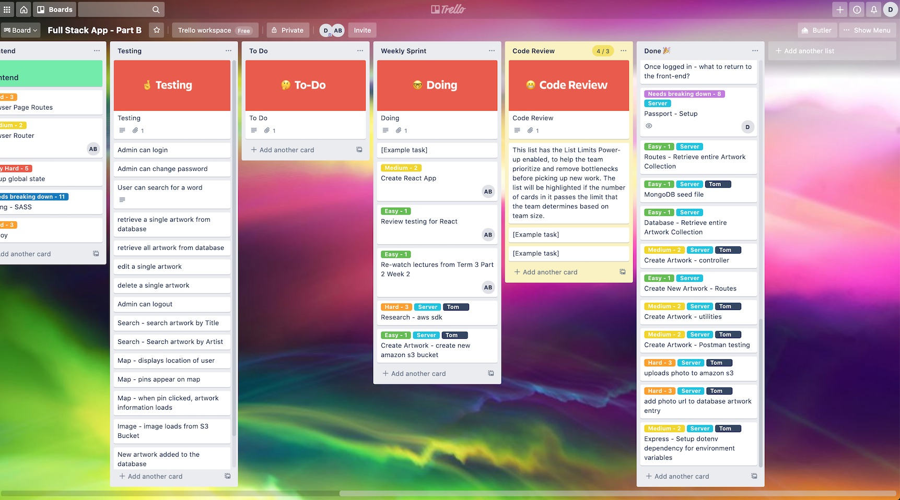
  
  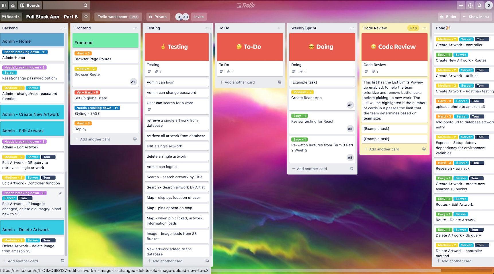
  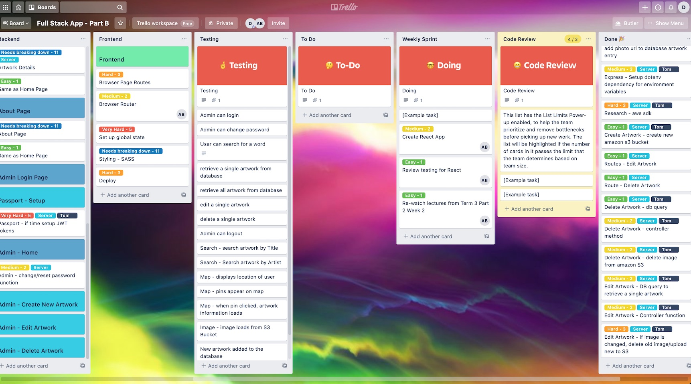

  
11/1/21 - 19/1/21

 

---
## Manual Testing

**Test**|**Expected Outcome**|**Actual Outcome**
:-----:|:-----:|:-----:
I want to be able to log in, to ensure security is not breached |
I want to be able to add new artworks, as they are commissioned or acquired by the City collection, to ensure information is up-to-date |
I want to be able to edit artworks I have added, so that I may correct any data entry errors I may have made |
I want to be able to delete artworks I have added, so that I may correct any data entry errors I may have made. |
I want to be able to log out, to ensure that no-one else using my computer can inadvertently add, delete or edit artworks |
Deny access if username/password is incorrect |
break | break
I want to be able to view all artworks on a map, so I can see their distribution in the City |
I want to view all artworks in a complete list, so I can browse all artworks |
I want to view details of individual artworks, so that I can learn the name of the artist, the name of the artwork, when it was made and installed, and any other interesting information |
I want to see a photo of the artwork, so I can decide whether it is worth visiting |
I want to know how long it will take me to navigate to the artwork |
I want to be able to search for an artwork, based on a keyword, so that I can refine the list of artworks I wish to see |
I want to know who made the application I am using, and why, so I can be assured of its integrity and use value |
I want to be able to contact the makers of the app, so that I can congratulate them on their fine work |
break | break
Map correctly shows current location |
App restricts access to add/edit/delete routes if user is unauthenticated |
Image loads when pin is clicked |
Shows errors when admin forms aren't filled in correctly | 

