# MAM---Documentation

**Deployed site:**
https://mammogrammo.netlify.app/

**Official Repo:**
https://github.com/MAM-MERN

**Tom's Working Fork:**
https://github.com/dunerztd/MAM-Server

**Alisa's Working Fork:**
https://github.com/alisay/MAM-Client

**Admin Account:**   
username: admin   
password: 123456

---
## Part A - Documentation

  
Click to Expand

  # T3A2-A - MERN Application (Part A)
A group project between Alisa Blakeney and Tom Dunstan

## R1. Description of your website, including:
- Purpose
- Functionality / features
- Target audience
- Tech stack	

This application displays the location of public artworks in City of Melbourne. It can be used to navigate between artworks and learn more about each. It has three main views: 
1. a landing page with a scan-and-scrollable map that shows the user's location and pin markers at the location of each artwork.
2. an about page with information about the public art collection, and with a colophon. 
3. a search view with an open text field that searches the title and artist of the artwork [with the option to view all as an alphabetically sorted list]

From the map view or the search results view, you can navigate to see a page with a photograph of the artwork and the metadata including title, artist, location, date, materials. 

Registered administrators can log in to add additional artworks to the database, and edit or delete artworks they have added. 

### Additional Features
- wayfinding (find the best route from you to another artwork, from one artwork to another)
- regular users can login to create a "favourites list" of artworks
- a "share" button that generates a shareable link

### Target Audiences
- Local residents interested in finding out more information about the artworks in their home town.
- Tourists interested in learning about the culture of the town they are visiting.
- Those with an academic interest in art, wanting a basic entry point into researching individual public artworks

### Tech stack

Frontend:
- React
- Axios
- Turf JS
- Netlify

Backend:
- Node
- Express
- Mongoose
- MongoDB
- Express Session
- Passport
- AWS S3
- Heroku
- Atlas

Testing:
- Jest

Source Control:
- Git
- GitHub

Documention and Planning:
- Trello
- Figma
- Lucid Chart
- Diagrams.net

---
## R2. Dataflow Diagram	

Click to expand

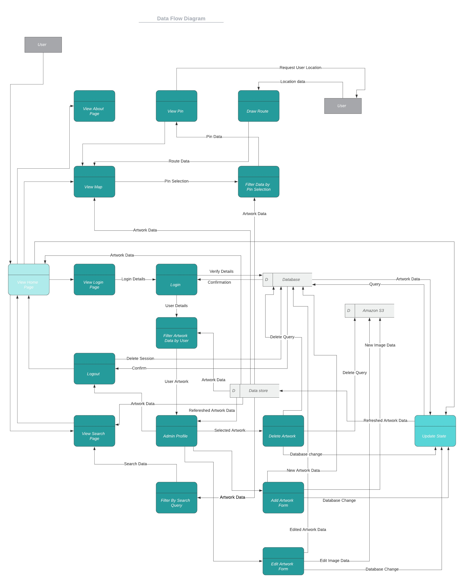

---	
## R3. Application Architecture Diagram

Click to expand

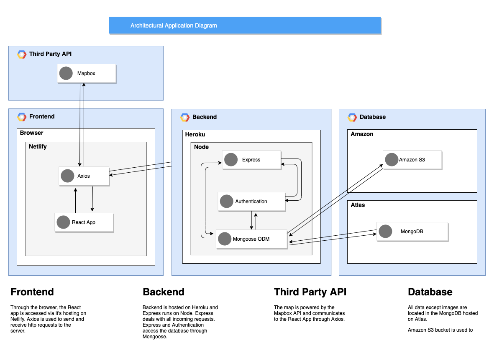

---	
## R4. User Stories	

#### Personae 

Click to expand

##### Felicity

Felicity is the curator of public art for City of Melbourne. She has a Master of Arts in curatorial practice for the public space. She is 35 years old, identifies as a woman, and is married with a small child. Since giving birth, she has become increasingly forgetful. She wants everyone to feel the same transformative power of art that she feels. She cares deeply about the people who live in City of Melbourne and wants to do her job as best as possible to represent them, the artists she works with, and feel professional integrity when she goes to sleep at night. 

##### Zal

Zal is a backpacker from Nijmegen. They have an international baccalaureate, but chose to travel before deciding on whether to attend tertiary education. They are 22 years old. Their first language is Dutch and but they speak a little English. They love bouldering, meeting new people, and adventure. 

##### Tim

Tim is a musician who lives in North Melbourne. He has studied various university degrees but never to completion. He is 67 years old. He has autism spectrum disorder, has a strong interest in local history, music, and tends to get overloaded by sensory information. Sometimes he works as a busker in public spaces of Melbourne. 

##### Mohammad

Mohammad is an artist who lives in Stoke on Trent. He is educated to PhD level in sculptural practice. He is 42 years old. He likes to travel, and his work at various large art institutions around the world means he has visited over one hundred countries. His art is exceptional, by virtue of his exacting standards.

#### User Stories

Click to expand

##### Users who are administrators

* As an administrator:
    * I want to be able to log in, to ensure security is not breached.
    * I want to be able to add new artworks, as they are commissioned or acquired by the City collection, to ensure information is up-to-date. 
    * I want to be able to edit or delete artworks I have added, so that I may correct any data entry errors I may have made.
    * I want to be able to log out, to ensure that no-one else using my computer can inadvertently add, delete or edit artworks.
    * I want to be able to reset my password, in the case that I forget or want it changed.
    * I do not wish to be able to edit artworks already in the database, as they are permanent installations and I do not wish to inadvertently delete their information.  

##### Users who are members of the general public

* As a member of the public:
    * I want to be able to view all artworks on a map, so I can see their distribution in the City. 
    * I want to view all artworks in a complete list, so I can browse all artworks.
    * I want to view details of individual artworks, so that I can learn the name of the artist, the name of the artwork, when it was made and installed, and any other interesting information. 
    * I want to see a photo of the artwork, so I can decide whether it is worth visiting. 
    * I want to know how long it will take me to navigate to the artwork. 
    * I want to be able to search for an artwork, based on a keyword, so that I can refine the list of artworks I wish to see. 
    * I want to know who made the application I am using, and why, so I can be assured of its integrity and use value. 
    * I want to be able to contact the makers of the app, so that I can congratulate them on their fine work. 

##### Felicity
* As a local goverment arts worker:
    * I want to have an easily accessible content management system, so as to be able to update the data on public artworks.
    * I want to be sure that my data is always consistent and correct, so that I can ensure I can providing accurate information to serve the residents in my constituency.
    * I want to have a way to reset my password when I forget what I set it to. 
    * I want the activities of my department represented in a way that is professional, clean and attractive, so I can feel a sense of pride about my work.

##### Zal
* As an urban explorer:
    * I want to easily see where sculptures and art installations are in the city I am visiting, so that I can plan out an itinerary for my bouldering activities. 
    * I want to learn more about the artworks I see as I am walking around, so that I can be educated on cultures other than my own. 
    * I want to make a note of my favourite artworks, so I can easily return to them on another day.
    * As someone with limited English, I want there to be clear informational graphics that guide my use of the app, so that I can navigate the different sections with ease. 

##### Tim
* As a troubadour and proud Melbournian: 
    * I want to know more about my city and the artworks I see daily, so that I can feel a warm sense of familiarity with my surroundings.
    * I want to be able to tell my audiences interesting facts about the monuments in front of which I busk, to add interest to my show.
    * I want to be routed directly to nearby artworks, so that I don't waste time in getting to work in the afternoons.
    * I want to see new artworks as they are added, so that I can be aware of where my council rates and taxes are being spent. 
    * I want the graphics and distracting information to be kept to a minimum, so as not to cause sensory overload. 

##### Mohammad
* As an artist whose artwork is in the City of Melbourne public art collection:
    * I want to be able to view my own artwork, even when I am not physically in Melbourne, so that I can experience some of the joy I am bringing to the local populace. 
    * I want to understand the context in which my artwork has been placed, so that I can be sure that my integrity as an artist is not compromised. 
    * I want my details and the information about my artwork to be prominent, accessible and accurate, so that I can ensure my moral rights as an artist are being respected.

---
## R5. Wireframes for multiple standard screen sizes, created using industry standard software	

Click to expand

[Click here to view prototype on Figma](https://www.figma.com/proto/qeHkwgWMhlNLU0kqAG7YAz/Wireframes?node-id=9%3A7&viewport=521%2C164%2C0.28764817118644714&scaling=scale-down)

Home: 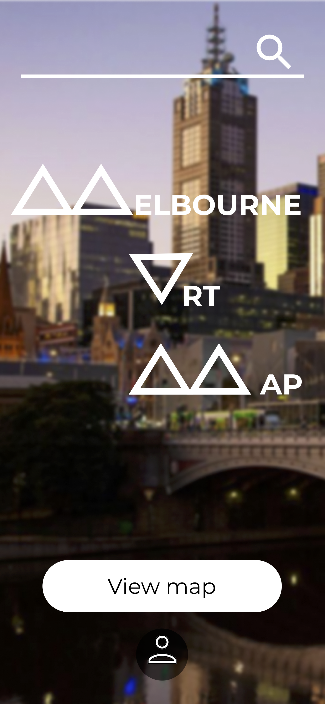  
Map view:   
Search view: 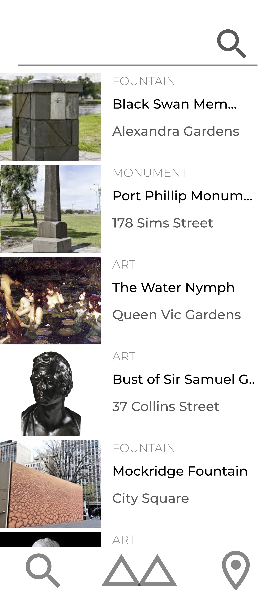  
Artwork details: 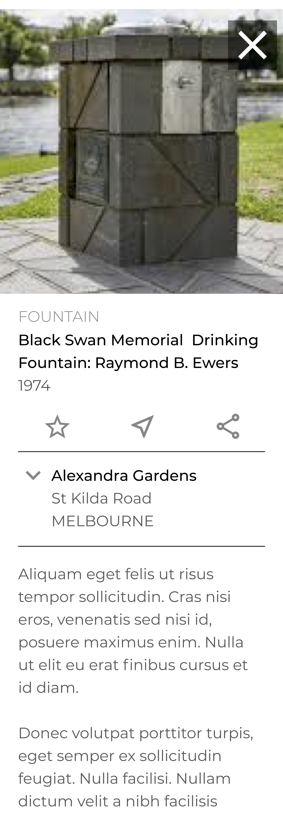  
About page:   
Administrator log in: 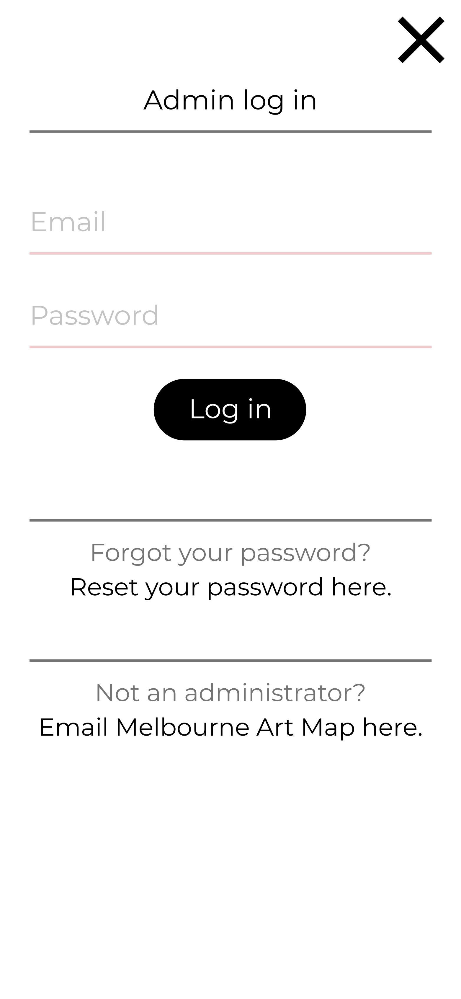  
Administrator home: 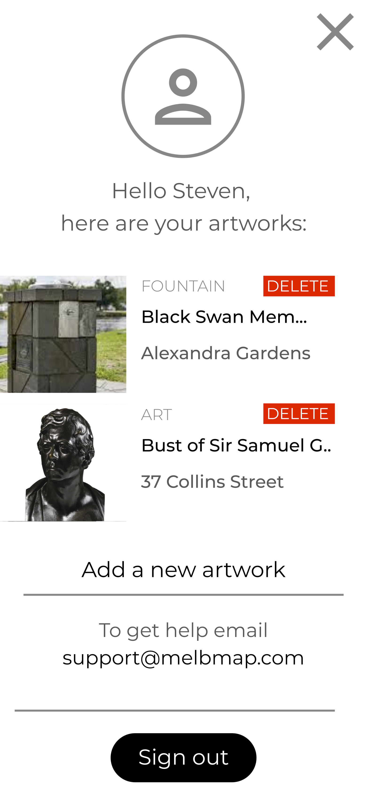  
Administrator add/edit artwork: 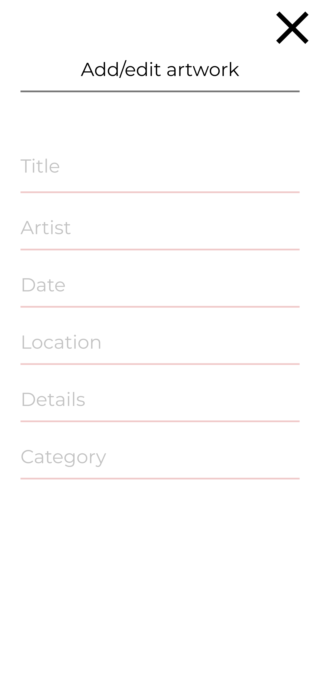  

---
## R6. Screenshots of your Trello board throughout the duration of the project	

Click to expand

Week 1
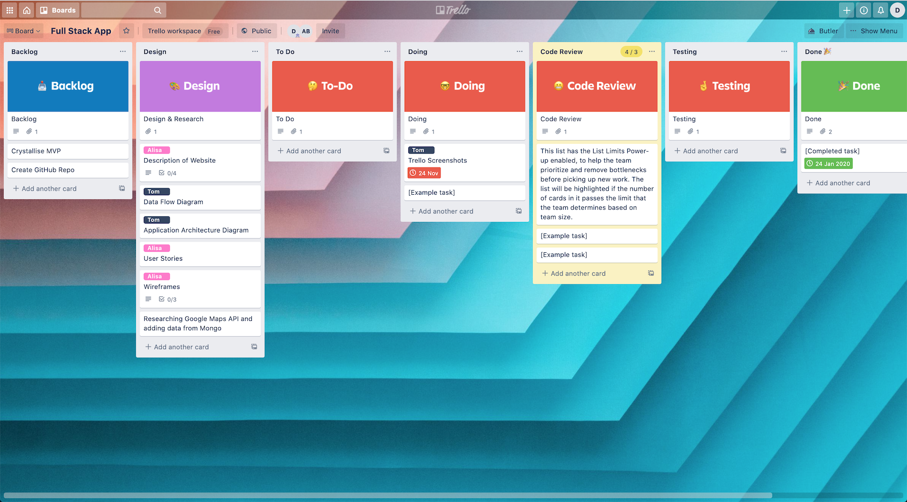

Week 2

Week 3
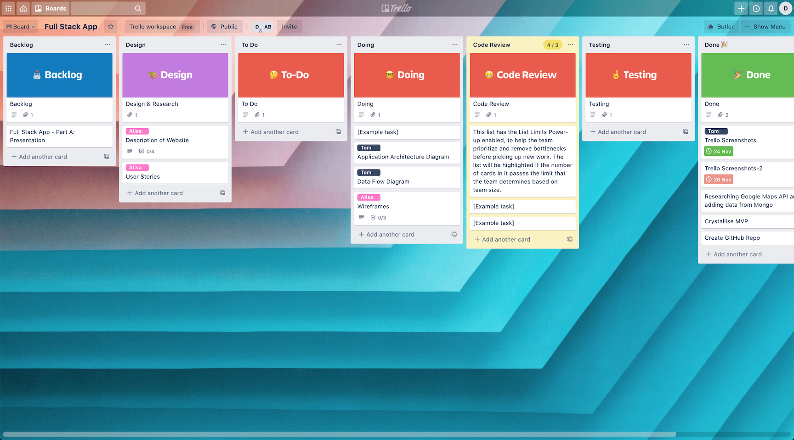

Week 4

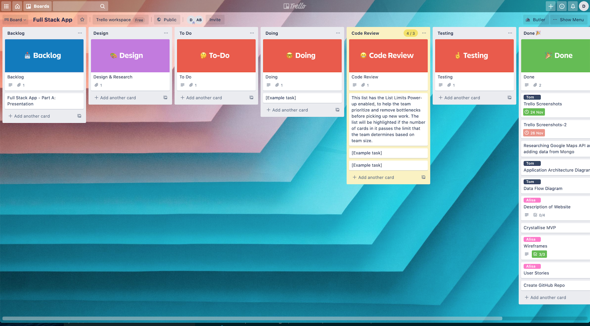

---
## Planning

We decided to split the application development into Backend and Frontend with Tom and Alisa handling them respectively. Alisa is stronger in react than Tom and since Tom handled the ADD and DFD and Alisa designed the wireframes in Part A, this pathway made the most sense.

Sprints will be weekly in duration with a standup on Mondays deciding the tasks to completed for the week. We will reconvene at the end of the week to update each other on our progress. Informal communication will be ongoing throughout the week.

All tasks will be added to Trello as tickets with labels indicating person to complete the task, whether it's server or client and a difficulty rating. The ratings are 1-Easy, 2-Medium, 3-Hard, 5-Very Hard, 8-Needs Breaking Down, 11-Needs Break Down.

There are 5 weekly sprint between Part A submission and Part B submission. We anticipate they will be broken down this way: 
Week starting 14 December: Planning 
Week starting 21 December: First prototype 
Week starting 28 December: Aim for usable final product 
Week starting 4 January: User testing 
Week starting 11 January: Finalize documentation ready for submission

---
## Libraries/Dependencies

### Server

**Library/Dependency**|**Description**
:-----|:-----
**aws-sdk** | Amazon web services software development kit for javascript. Allows developers to connect to AWS services through javascript objects
**connect-mongo** | Session store for MongoDB
**cors** | Enables CORS in an Express app
**dotenv** | Loads environment variables into process.env
**ejs** | Generates HTML markup with embedded javascript
**express** | Web application framework for Node
**express-fileupload** | Express middleware for uploading files
**express-session** | Session middleware for Express
**mongoose** | Object Data Modeling library for MongoDB and Node
**mongoose-bcrypt** | A mongoose plugin for encrypting fields with bcrypt
**passport** | Authentication middleware for Express/Node
**passport-local** | Passport strategy for authenticating with a username and password
**chai** | An assertion library for Node
**mocha** | Javascript testing framework
**nodemon** | Automatically restarts a Node application when changes are made

### Client

|**Library/Dependency**|**Description**
:-----|:-----
|**@material-ui/core** | A React UI framework comprising components, styles, themes and icons
**@material-ui/icons** | Material-UI icons as React components
**@material-ui/lab** | Material-UI components not available in core
**@react-google-maps/api** | React components wrapping the Google maps Javascript API
**@testing-library/jest-dom** | Custom Jest matchers for testing the DOM
**@testing-library/react** | React component testing
**@testing-library/user-event** | Simulates user interaction with the browser for testing purposes
**axios** | Promise based HTTP client for the browser and Node
**fontsource-roboto** | Self-host the 'Roboto' font
**google-maps-react** | A Google Map React component library
**react** | A Javascript library for building user interfaces
**react-dom** | Renders React components in the DOM
**react-geocode** | Transforms a location into it's longitude and latitude coordinates
**react-router-dom** | DOM bindings for React Router
**react-scripts** | Create React App scripts and configuration
**web-vitals** | Library for measuring all the Web Vitals metrics

---
# Source Control
Git was employed as source control. A separate GitHub account, purely for the project was made and both members were given access. The MAM account had three repositories, one for the client, server and documentation. Each member forked this repo to their personal GitHub and they primarily worked from this. Once a feature was completed, pull requests were made to the MAM repo where the other member could review their code and merge.

# project management
# task delegation

  
14/12/20 - 20/12/20

  
  
  

  
21/12/20 - 27/12/20

  
  

  
28/12/20 - 3/1/21

  
  
  

  
4/1/21 - 10/1/21

  
  
  
  

  
11/1/21 - 19/1/21

    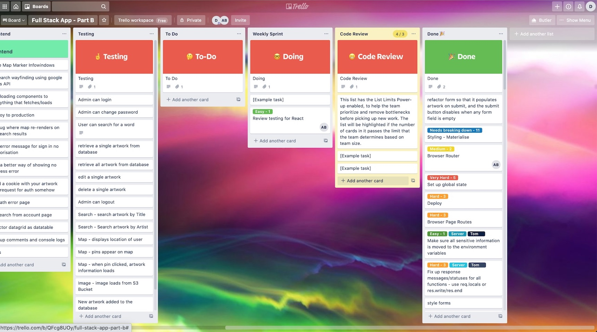
    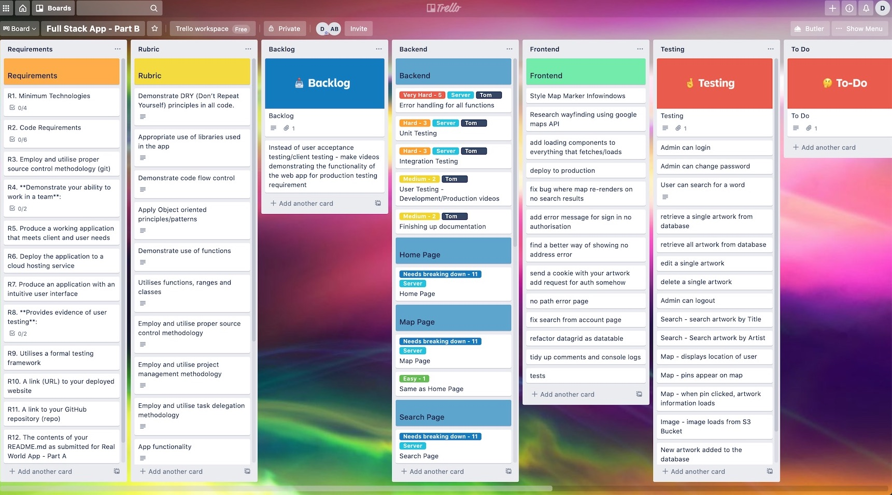
    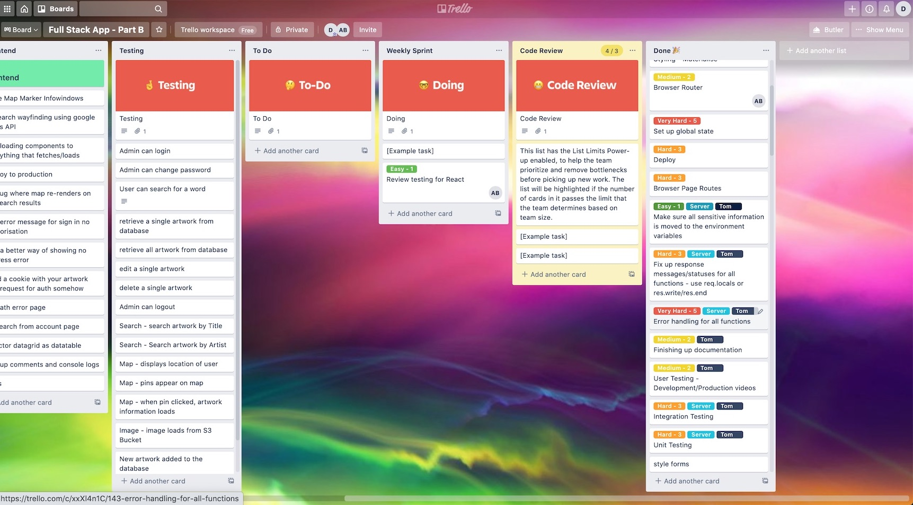 

---
## Testing

Informal testing was done during and at the end of each completed function by both members. A combination of user testing and Postman were used to achieve this.

Automated tests were written for the server and a screenshot can be seen below. Unit tests for the artworks CRUD functionality and integration tests for the artworks routes, controllers and database queries. Mocha was the testing framework and chai/expect for the assertion libraries. Chai-HTTP for http integration tests.

  
Automated Testing Screen Shot

    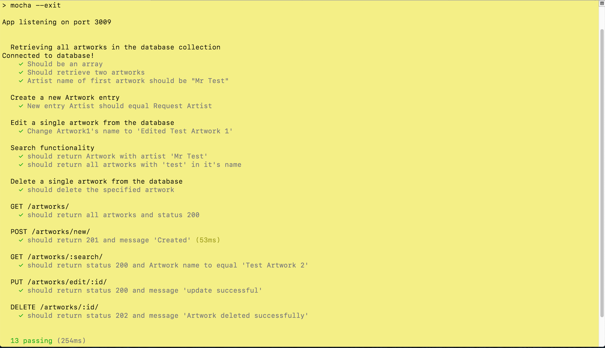

## Manual Testing

**Test**|**Expected Outcome**|**Actual Outcome**
:-----:|:-----:|:-----:
I want to be able to log in, to ensure security is not breached |
I want to be able to add new artworks, as they are commissioned or acquired by the City collection, to ensure information is up-to-date |
I want to be able to edit artworks I have added, so that I may correct any data entry errors I may have made |
I want to be able to delete artworks I have added, so that I may correct any data entry errors I may have made. |
I want to be able to log out, to ensure that no-one else using my computer can inadvertently add, delete or edit artworks |
Deny access if username/password is incorrect |
break | break
I want to be able to view all artworks on a map, so I can see their distribution in the City |
I want to view all artworks in a complete list, so I can browse all artworks |
I want to view details of individual artworks, so that I can learn the name of the artist, the name of the artwork, when it was made and installed, and any other interesting information |
I want to see a photo of the artwork, so I can decide whether it is worth visiting |
I want to know how long it will take me to navigate to the artwork |
I want to be able to search for an artwork, based on a keyword, so that I can refine the list of artworks I wish to see |
I want to know who made the application I am using, and why, so I can be assured of its integrity and use value |
I want to be able to contact the makers of the app, so that I can congratulate them on their fine work |
break | break
Map correctly shows current location |
App restricts access to add/edit/delete routes if user is unauthenticated |
Image loads when pin is clicked |
Shows errors when admin forms aren't filled in correctly | 

## User Testing - Development/Production

### Map and Search
<a href="docs/videos/map-search.webm">Video</a>   
Video shows map with clickable artwork pins. Basic map functions such as zoom in/out and satellite/map display. Pins are clicked to show artwork details and image.
The search box finds an image by artwork title and brings up the same information as if the pin was clicked.

### Admin Login/Logout and Dashboard
<a href="docs/videos/admin-login-dashboard-logout.webm">Video</a>   
Video shows login/logout procedure for the admin account. Once logged in, the admin dashboard displays a list of all artworks on the map with buttons to add/edit or delete a selected artwork. The video also shows the admin navbar menu.

### Admin Add New Artwork
<a href="docs/videos/admin-add-artwork.webm">Video</a>   
Video shows procedure to add a new artwork to the map. Admin fills out a form with all required details including attaching an image. Returning to the map view shows the new artwork entry.

### Admin Edit an Artwork
<a href="docs/videos/admin-edit-artwork.webm">Video</a>   
Video shows procedure to edit an artwork. The edited artwork is shown however it makes a new entry instead of editing and leaves the original still in the database.

### Admin Delete an Artwork
<a href="docs/videos/admin-delete-artwork.webm">Video</a>   
Video shows deleting of an artwork. Returning to the map shows the artwork is no longer displayed.
